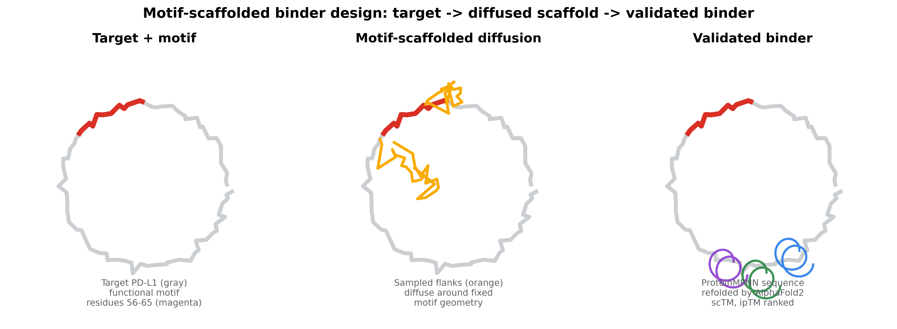
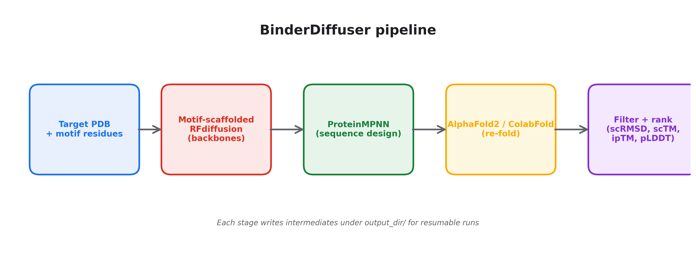
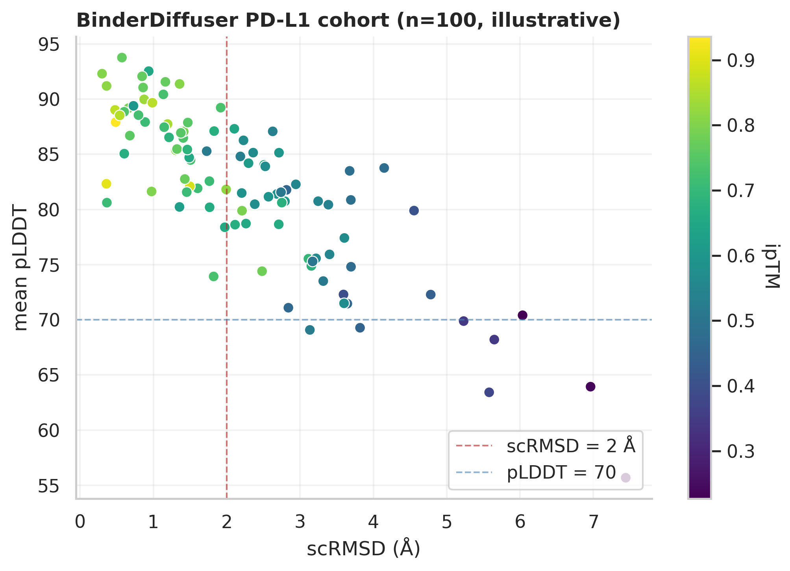
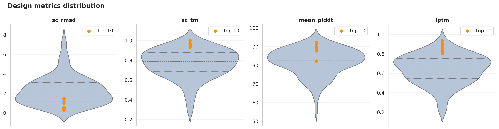

# BinderDiffuser

**De novo protein binder design via motif-scaffolded diffusion + sequence design + structural validation.**

[](https://colab.research.google.com/github/deepmind11/BinderDiffuser/blob/main/notebooks/02_colab_run.ipynb)
[](https://github.com/deepmind11/BinderDiffuser/actions/workflows/ci.yml)
[](LICENSE)



BinderDiffuser is an end-to-end pipeline for designing protein binders against
a chosen target. It composes three battle-tested components into one
reproducible workflow:

1. **Motif-scaffolded RFdiffusion** generates novel backbones conditioned on
   a fixed functional motif (the binding hot-spot of the target).
2. **ProteinMPNN** designs sequences for those backbones, with target chain
   and motif residues held fixed.
3. **AlphaFold2** (via ColabFold) re-folds each designed sequence and the
   pipeline computes self-consistency metrics (scRMSD, scTM, pLDDT, ipTM,
   pAE_interface) to filter and rank candidates.

The reference example targets **PD-L1** (programmed death-ligand 1, gene
`CD274`) — the canonical immune checkpoint shared by pembrolizumab,
atezolizumab, and durvalumab.

---

## Pipeline



Each stage writes intermediates under `output_dir/` so a crashed run can be
resumed by re-invoking from the failed stage; the orchestration code lives in
[`src/binderdiffuser/pipeline.py`](src/binderdiffuser/pipeline.py).

---

## Why this design

**Motif scaffolding > unconditional generation.** Naive backbone diffusion
samples folds without regard to where they should bind on the target. By
fixing a motif (e.g. PD-L1 residues 56-65) and letting RFdiffusion grow
scaffold *around* it, the generated cohort concentrates at the productive
binding face from sample one. The contig grammar exposed by RFdiffusion is a
small DSL; this repo includes a typed builder
([`motif_spec.py`](src/binderdiffuser/diffusion/motif_spec.py)) that
generates valid contigs from a high-level `MotifSpec`.

**Self-consistency > MPNN scoring alone.** A ProteinMPNN log-likelihood
score reflects how plausible a sequence is *given* a backbone, but it does
not check whether the sequence will actually fold to that backbone. The
self-consistency loop solves that: re-fold the designed sequence with AF2,
then check whether AF agrees with the diffuser. Designs where the two
disagree (high scRMSD, low scTM) are filtered out before any wet-lab work.

**Backend swap-in for AlphaFold3.** AlphaFold3 has higher accuracy and a
public CLI is on the way. The
[`AlphaFoldRunner`](src/binderdiffuser/validation/alphafold_runner.py)
abstracts over the backend so an AF3 swap is a one-line config change once
the public CLI lands.

---

## Results visualization

After a run, `binderdiffuser report <run_dir>` regenerates the canonical
diagnostic plots from `designs.csv`:



The lower-left/upper-right quadrant (low scRMSD, high pLDDT, high ipTM) is
where the productive designs cluster. The dashed lines mark the default
filter thresholds (scRMSD = 2 Å, pLDDT = 70).



The violin plots make it easy to see whether a run is producing a meaningful
right tail (top-K marked in orange) or a uniformly mediocre cohort.

> **Note:** the figures above are rendered from a synthetic cohort
> (`figures/sample_designs.csv`) so the README is interactive without
> requiring the reader to run GPU inference. Replace the CSV with a real run
> via `binderdiffuser report path/to/your/run/`.

---

## Quick start

### Install

```bash
git clone https://github.com/deepmind11/BinderDiffuser.git
cd BinderDiffuser
pip install -e ".[dev,notebooks]"
```

The CPU-friendly stages (motif extraction, contig builder, metric helpers,
filter/rank, viz) work out of the box. RFdiffusion and ColabFold are external
GPU-bound binaries; install them via the
[Dockerfile](docker/Dockerfile) or follow upstream install guides:

- RFdiffusion: <https://github.com/RosettaCommons/RFdiffusion>
- ProteinMPNN: <https://github.com/dauparas/ProteinMPNN>
- ColabFold: <https://github.com/sokrypton/ColabFold>

### Preview a run

Sanity-check the contig setup without GPU:

```bash
binderdiffuser show-contigs examples/pdl1_binder/config.yaml -n 5
```

Sample output:

```
[00] seed=348282721  B1-65/0 12,B56-65,15
[01] seed=121478392  B1-65/0 8,B56-65,22
[02] seed=940482910  B1-65/0 19,B56-65,11
...
```

### Full run (GPU)

```bash
binderdiffuser run examples/pdl1_binder/config.yaml
```

This drives RFdiffusion → ProteinMPNN → ColabFold and writes:

```
examples/pdl1_binder/runs/v1/
├── backbones/            # RFdiffusion outputs
├── sequences/            # ProteinMPNN outputs (per-backbone FASTAs + bundle)
├── alphafold/            # ColabFold outputs (per-sequence PDBs + score JSONs)
├── designs.csv           # one row per (backbone, sequence) pair with all metrics
└── figures/              # regeneratable plots
```

---

## Repository layout

```
src/binderdiffuser/
├── config.py              # Pydantic schemas; YAML round-trip
├── targets.py             # PDB parsing, motif residue extraction
├── diffusion/
│   ├── motif_spec.py      # RFdiffusion contig string builder
│   └── rfdiff_wrapper.py  # subprocess wrapper for run_inference.py
├── sequence/
│   └── mpnn_runner.py     # ProteinMPNN runner + FASTA parser
├── validation/
│   ├── alphafold_runner.py  # ColabFold / AF2/3 wrapper
│   ├── metrics.py           # scRMSD, scTM, pLDDT, ipTM, pAE_iface
│   └── filters.py           # threshold filtering + composite ranking
├── pipeline.py            # end-to-end orchestration (run_pipeline)
├── viz.py                 # scatter / violin / PyMOL script helpers
└── cli.py                 # `binderdiffuser run | show-contigs | report`

examples/pdl1_binder/      # PD-L1 worked example
notebooks/                 # walkthroughs (5 sections, no GPU required)
figures/                   # README-facing artifacts
docker/                    # GPU image (CUDA 12.1 + PyTorch 2.2 + ColabFold)
tests/                     # 51 unit tests
.github/workflows/ci.yml   # py3.10/3.11/3.12 matrix; ruff + pytest
```

---

## Tests

```bash
pytest --cov=binderdiffuser tests/
```

51 unit tests covering:

| Module | Tests |
|--------|-------|
| `targets` | PDB loading, chain selection, residue extraction, motif segmentation (contiguous, disjoint, unsorted, duplicates, error paths) |
| `motif_spec` | Validation, contig format, length envelope honoured, reproducibility under seed |
| `metrics` | Kabsch (identity, translation, rotation, known offset, shape mismatch), TM-score (perfect alignment, monotonic with noise, d0 clamp), pLDDT, ipTM (multiple JSON field names, missing/non-numeric), pAE_interface |
| `filters` | Threshold pass/fail, composite ordering, top-K, missing optional metrics, DataFrame round-trip |

---

## Roadmap

- [ ] Wire AlphaFold3 backend once the public CLI is released
- [ ] Add a Boltz-1 backend alongside AF2 for cross-tool consensus filtering
- [ ] Add Rosetta InterfaceAnalyzer scoring as a post-filter signal
- [ ] Add a `binderdiffuser sweep` subcommand for hyperparameter sweeps
- [ ] Add a Streamlit dashboard for run inspection

---

## References

- Watson J. et al. *De novo design of protein structure and function with RFdiffusion.* **Nature** 620, 1089-1100 (2023). <https://www.nature.com/articles/s41586-023-06415-8>
- Dauparas J. et al. *Robust deep learning-based protein sequence design using ProteinMPNN.* **Science** 378, 49-56 (2022). <https://www.science.org/doi/10.1126/science.add2187>
- Jumper J. et al. *Highly accurate protein structure prediction with AlphaFold.* **Nature** 596, 583-589 (2021). <https://www.nature.com/articles/s41586-021-03819-2>
- Cao L. et al. *Design of protein-binding proteins from the target structure alone.* **Nature** 605, 551-560 (2022). <https://www.nature.com/articles/s41586-022-04654-9>
- Mirdita M. et al. *ColabFold: making protein folding accessible to all.* **Nature Methods** 19, 679-682 (2022). <https://www.nature.com/articles/s41592-022-01488-1>

---

## License

MIT — see [LICENSE](LICENSE).
